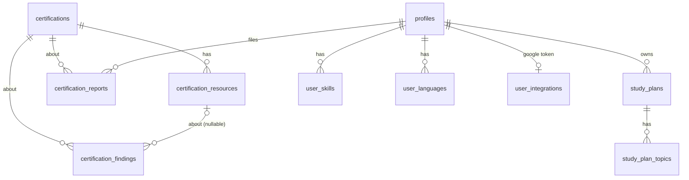

# SkillStack database — reference for n8n

Everything the n8n automation needs to read from and write to the SkillStack
database: how to connect, the full table list, the exact columns, and the two
things the workflow actually does (link-health checks and resource discovery).

The schema lives in `supabase/schema.sql` + `supabase/migrations/*.sql`; this
doc is the human-readable summary of it as of migration `20260719000003`.

---

## 1. How n8n connects

n8n talks to Supabase with the **`service_role` key** (`SUPABASE_SERVICE_ROLE_KEY`).
That key **bypasses Row-Level Security (RLS)** entirely, which is the whole
reason the bot can write to tables the app's browser clients cannot touch
(`certification_findings`, `certifications`, `certification_resources`).

> ⚠️ The service_role key is a backend secret. It lives only in n8n and the
> server. It must **never** reach a browser.

Two ways to use it — pick one per node:

**A. Postgres node** (direct connection) — use the Supabase project's Postgres
connection string (Project Settings → Database). Full SQL, best for the
discovery queries and the promote step.

**B. HTTP Request node** (PostgREST REST API):

```
Base URL:  {SUPABASE_URL}/rest/v1
Headers:   apikey: {SERVICE_ROLE_KEY}
           Authorization: Bearer {SERVICE_ROLE_KEY}
           Content-Type: application/json
           Prefer: return=representation      # to get the inserted row back
```

`{SUPABASE_URL}` is `https://<project-ref>.supabase.co`.

Examples:

```
GET  {SUPABASE_URL}/rest/v1/certifications?select=id,name,exam_cost,official_url
GET  {SUPABASE_URL}/rest/v1/certification_resources?select=id,url,dead,http_status&dead=is.false
POST {SUPABASE_URL}/rest/v1/certification_findings      # body = one finding (see §5)
PATCH {SUPABASE_URL}/rest/v1/certification_resources?id=eq.r7   # body = {"http_status":404,"dead":true,...}
```

---

## 2. The security model in one line

| RLS posture | Tables | Who can write |
|---|---|---|
| **Public read, no write policy** | `certifications`, `certification_resources` | anyone can `SELECT`; only `service_role` can write |
| **Owner-scoped** | `profiles`, `user_skills`, `user_languages`, `study_plans`, `study_plan_topics`, `certification_reports` | each user sees/edits only their own rows |
| **RLS on, zero policies (service-role only)** | `user_integrations`, `llm_calls`, `certification_findings` | only `service_role` can read or write |

n8n uses `service_role`, so it can do **everything** — this table is about what
the *app* (anon/authenticated keys) can do, which is what keeps the automation's
tables private.

---

## 3. Tables n8n cares about

These are the ones the discovery/link-health workflow reads and writes. Full
list of every table is in §6.

### `certifications` — the catalog (read; write facts corrections)

The 28-ish certifications. Public read; n8n writes with the service key.

| Column | Type | Notes |
|---|---|---|
| `id` | text PK | e.g. `aws-saa`, `az-900` |
| `name` | text | |
| `short_name` | text | e.g. `AZ-900` |
| `provider` | text | e.g. `Microsoft` |
| `category` | text | one of: `cloud, ai, cybersecurity, networking, programming, data, project-management, devops` |
| `description` | text | |
| `difficulty` | text | one of: `beginner, intermediate, advanced, expert` |
| `estimated_study_hours` | int | `> 0` |
| `exam_cost` | numeric(10,2) | `>= 0` |
| `exam_cost_currency` | text | default `USD` |
| `exam_duration` | int | minutes, `> 0` |
| `number_of_questions` | int | `> 0` |
| `passing_score` | int | `0..100` |
| `languages` | text[] | |
| `remote_testing` | bool | default true |
| `prerequisites` | text[] | |
| `career_opportunities` | jsonb | array of `{title, salaryMin, salaryMax, currency}` |
| `skills_gained` | text[] | |
| `official_url` | text | must start with `http` — this is the source of truth n8n re-checks |
| `tags` | text[] | |
| `trending` | bool | |
| `free` | bool | |
| `verified_at` | date | when a human/bot last confirmed the facts |
| `verified_by` | text | provenance, e.g. `n8n` |
| `search_text` | text | **do not set** — a trigger rebuilds it on every write |
| `created_at`, `updated_at` | timestamptz | `updated_at` is trigger-maintained |

n8n reads `official_url` + the fact columns to detect drift, and files a
`cert_facts` finding (see §5) rather than editing the row directly — a human
approves catalog edits.

### `certification_resources` — learning resources (read; write link health)

The links shown on each certification's plan. Public read; service-role write.

| Column | Type | Notes |
|---|---|---|
| `id` | text PK | e.g. `r1`…`r31`, then uuids for promoted ones. **Referenced by `study_plans.plan → weeks[].resourceIds`, so never renumber or delete — mark `dead` instead.** |
| `certification_id` | text | → `certifications(id)`, cascade delete |
| `title` | text | |
| `provider` | text | |
| `url` | text | must start with `http` |
| `duration` | text | freeform, e.g. `40 hours` |
| `free` | bool | |
| `type` | text | one of: `course, documentation, video, practice-exam, book` |
| `ai_reason` | text | why the advisor should pick it (shown to the model, not the user) |
| `verified_at` | date | |
| `verified_by` | text | e.g. `n8n` |
| `last_checked_at` | timestamptz | **n8n owns this** — set on every health check |
| `http_status` | int | **n8n owns this** — null = never checked |
| `dead` | bool | **n8n owns this** — true hides it from the app without breaking plan links |

For link health, n8n **updates these rows directly** (service-role can):
`last_checked_at`, `http_status`, `dead`. For a title/price/duration change it
notices, it files a `resource_changed` finding instead of overwriting.

### `certification_findings` — the bot's review queue *(NEW — write here)*

**This replaces the old `certification_reports` path for n8n.** All bot output
goes here now. RLS on with no policies → service-role only (private to the bot
and reviewers).

| Column | Type | Notes |
|---|---|---|
| `id` | uuid PK | auto |
| `certification_id` | text | → `certifications(id)`, required, cascade delete |
| `resource_id` | text | → `certification_resources(id)`, **nullable** — null for a brand-new resource that doesn't exist yet, or a `cert_facts` finding |
| `field` | text | one of: `resource_new, resource_dead, resource_changed, cert_facts` |
| `message` | text | human summary, 1–1000 chars, **required** |
| `proposal` | jsonb | machine-readable patch (see §5); null for non-resource findings |
| `source_site` | text | URL host of a proposed resource, e.g. `youtube.com` |
| `confidence` | numeric(3,2) | `0..1`, lets triage sort |
| `status` | text | `open` (default), `accepted`, `rejected` |
| `created_at` | timestamptz | auto |

There is **no `user_id` and no `source`** on this table — findings are always
the bot's, so those columns from the old shared table are gone.

---

## 4. ⚠️ What changed in the split (do this in n8n)

Before: the bot inserted into **`certification_reports`** with
`source='n8n'`, `field='resource_new'`, etc.

After migration `20260719000003`:

- `certification_reports` is now **user corrections only** — its `field` check
  only allows the six human values, and it has no `source`/`proposal`/
  `resource_id`/`source_site`/`confidence` columns anymore. **A bot insert into
  it will now fail the check constraint.**
- The bot writes to **`certification_findings`** instead. Drop `user_id` and
  `source` from the insert; everything else maps 1:1 (`proposal`, `source_site`,
  `confidence`, `field`, `message`, `resource_id`, `certification_id`).

So in the n8n workflow: **change the target table of every insert from
`certification_reports` to `certification_findings`, and remove `user_id`/
`source` from the body.** Nothing else in the payload changes.

---

## 5. Exact payloads the bot writes

### A new resource worth adding (`resource_new`)

The `proposal` must carry the columns the promote step reads
(`scripts/promote-reviewed-resources.sql`): `url, title, provider, duration,
free, type, ai_reason`. `certification_id` comes from the finding row, not the
proposal.

```jsonc
POST /rest/v1/certification_findings
{
  "certification_id": "aws-saa",
  "field": "resource_new",
  "message": "Proposed course: freeCodeCamp AWS SAA full course",
  "source_site": "youtube.com",
  "confidence": 0.82,
  "proposal": {
    "url": "https://www.youtube.com/watch?v=...",
    "title": "AWS Certified Solutions Architect – full course",
    "provider": "freeCodeCamp",
    "duration": "10 hours",
    "free": true,
    "type": "course",            // course | documentation | video | practice-exam | book
    "ai_reason": "Covers all exam domains, free, highly rated"
  }
  // status defaults to "open"
}
```

The promote script coerces freeform `type` values (`Course`, `Study Guide`,
`official exam page`…) onto the five allowed types — anything unrecognised
becomes `documentation` — so the bot doesn't have to be exact, but staying on
the five is cleaner.

### A dead link (`resource_dead`)

Two parts: **update the resource row** (so the app hides it now) **and** file a
finding (so a human sees why).

```jsonc
PATCH /rest/v1/certification_resources?id=eq.r7
{ "http_status": 404, "dead": true, "last_checked_at": "2026-07-19T18:00:00Z" }
```
```jsonc
POST /rest/v1/certification_findings
{
  "certification_id": "aws-saa",
  "resource_id": "r7",
  "field": "resource_dead",
  "message": "URL returns 404 since 2026-07-19",
  "confidence": 1.0
}
```

### A resource whose details drifted (`resource_changed`)

Don't overwrite silently — propose the change and let a reviewer apply it.

```jsonc
POST /rest/v1/certification_findings
{
  "certification_id": "aws-saa",
  "resource_id": "r7",
  "field": "resource_changed",
  "message": "Price changed from free to paid; title updated",
  "confidence": 0.7,
  "proposal": { "free": false, "title": "New title", "url": "https://..." }
}
```

### A certification fact that drifted (`cert_facts`)

`resource_id` is null — this is about the certification itself, checked against
its `official_url`.

```jsonc
POST /rest/v1/certification_findings
{
  "certification_id": "az-900",
  "field": "cert_facts",
  "message": "Exam cost is now $99, official page shows $99 (was $99 already? verify)",
  "confidence": 0.6,
  "proposal": { "exam_cost": 99, "evidence_url": "https://learn.microsoft.com/..." }
}
```

### Promoting accepted proposals into the live catalog

Run `supabase/scripts/promote-reviewed-resources.sql` in the Supabase SQL
editor (or an n8n Postgres node). It reads **`certification_findings`** where
`field='resource_new'` and `status='open'`, copies each `proposal` into
`certification_resources` (deduping by url), and marks the finding `accepted`.
It's transactional and safe to re-run.

---

## 6. Every table (full list)

App-owned, owner-scoped by RLS — **n8n normally leaves these alone** (they're
user data), but the service key can read them if a workflow ever needs to:

| Table | What it holds | Key columns |
|---|---|---|
| `profiles` | one row per user | `id` (=auth user id), `email`, `full_name`, `career_goal`, `job_role`, `experience_level`, `budget`, `budget_currency`, `daily_study_time`, `weekly_availability`, `preferred_resource_formats[]`, `preferred_resource_sites[]`, `advisor_settings` jsonb |
| `user_skills` | skills a user claims | `user_id`, `skill_name`, `level` (`beginner/intermediate/advanced`), unique(user_id, skill_name) |
| `user_languages` | languages a user speaks | `user_id`, `language_name`, unique(user_id, language_name) |
| `study_plans` | a user's plan per cert | `user_id`, `certification_id` (text), `target_date`, `plan` jsonb (weeks/topics/hours), unique(user_id, certification_id) |
| `study_plan_topics` | per-topic progress | `study_plan_id`, `topic_id` (text, matches an id inside `plan` jsonb), `completed`, `completed_at`, `calendar_event_id`, unique(study_plan_id, topic_id) |

Service-role-only (private):

| Table | What it holds | Key columns |
|---|---|---|
| `user_integrations` | Google refresh tokens for calendar sync | `user_id`, `provider` (`google`), `refresh_token`, `scope`, unique(user_id, provider) |
| `llm_calls` | rate-limit counter for the AI endpoints | `user_id`, `action`, `created_at` |
| `certification_findings` | **the bot's queue** (see §3) | as above |

Public read / service-role write (catalog):

| Table | What it holds |
|---|---|
| `certifications` | the certification catalog (§3) |
| `certification_resources` | learning resources per cert (§3) |

Owner-scoped, human-written:

| Table | What it holds | Key columns |
|---|---|---|
| `certification_reports` | **user** corrections only, after the split | `certification_id`, `user_id`, `field` (`exam_cost/study_hours/exam_details/prerequisites/url/other`), `message`, `status` (`open/accepted/rejected`) |

### The `plan` jsonb shape (inside `study_plans.plan`)

```jsonc
{
  "summary": "…",
  "recommended": true,
  "weeks": [
    {
      "weekNumber": 1,
      "title": "Fundamentals",
      "estimatedHours": 6,          // derived: sum of the week's topic hours
      "hasPracticeExam": false,
      "isReviewWeek": false,
      "resourceIds": ["r1", "r7"],  // → certification_resources.id
      "topics": [
        { "id": "<uuid>", "title": "…", "description": "…", "estimatedHours": 3 }
      ]
    }
  ]
}
```

The `topics[].id` values are what `study_plan_topics.topic_id` points at — that's
how per-topic completion is tracked. `resourceIds` reference
`certification_resources.id`, which is exactly why a resource must be marked
`dead`, never deleted.

---

## 7. Relationships



`study_plans.certification_id` and `study_plan_topics.topic_id` are **text keys,
not foreign keys** — plans reference the catalog by id but aren't constrained to
it, so a plan survives a catalog edit.

---

## 8. Checklist for updating n8n after the split

- [ ] Change every insert target from `certification_reports` → `certification_findings`.
- [ ] Remove `user_id` and `source` from those insert bodies.
- [ ] Keep `certification_id`, `field`, `message`, `proposal`, `source_site`, `confidence`, `resource_id`.
- [ ] Link-health updates to `certification_resources` (`http_status`, `dead`, `last_checked_at`) are unchanged.
- [ ] The promote step already reads `certification_findings` (script updated) — no n8n change unless you run promotion from n8n, in which case point that node at the updated script.
```
